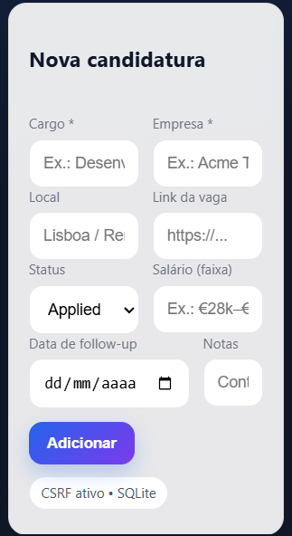
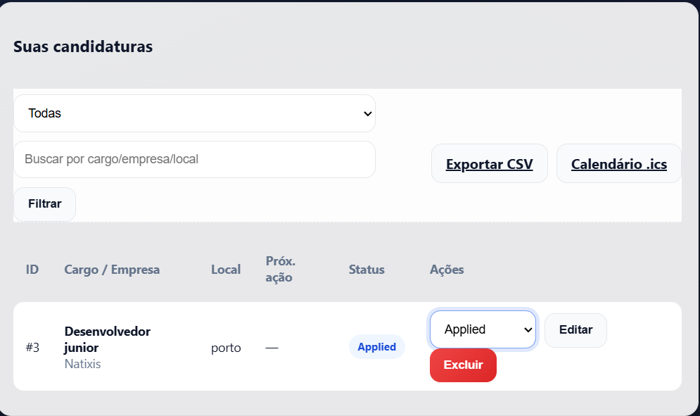

# JobTrackr — rastreador de candidaturas (PHP + SQLite)

[](#)
[](#)
[](LICENSE)
[](https://alexdevcode.com)

**JobTrackr** é um app leve (single-file) para organizar candidaturas de emprego: registe cargo, empresa, status (Applied, Screening, Interviewing, Offer, Rejected), follow-up com data, notas e exporte tudo em CSV ou .ics para o seu calendário.

> UI moderna (glass, gradientes), responsiva e com animações suaves.  
> Perfeito para uso pessoal e como case técnico no portefólio.

---

## Funcionalidades

- CRUD completo de candidaturas  
- Filtros + busca por cargo, empresa e local  
- Badges de status com cores (Applied/Screening/Interviewing/Offer/Rejected)  
- Follow-up por data e exportação .ics (Google Calendar/Outlook)  
- Exportação CSV para Excel/Sheets  
- CSRF ativo em todos os POSTs  
- SQLite via PDO (cria a base automaticamente)  
- Código single-file fácil de ler e levar para entrevistas

---

## Screenshots / Demo


| Nova candidatura | Lista + filtros |
|---|---|
|  |  |


## Como executar

### Opção A) XAMPP (Windows)

1. Crie a pasta: `C:\xampp\htdocs\jobtrackr\`  
2. Salve o arquivo `index.php` dentro dessa pasta.  
3. Abra `C:\xampp\php\php.ini` e habilite (remova `;` se houver):

```ini
extension=sqlite3
extension=pdo_sqlite
Reinicie o Apache no XAMPP Control Panel.

Aceda: http://localhost/jobtrackr/
Na primeira visita, o ficheiro data.sqlite é criado automaticamente.

Opção B) Servidor embutido do PHP (qualquer OS)

php -S localhost:8080
# aceda: http://localhost:8080
Requisitos
PHP 8.1+

Extensões sqlite3 e pdo_sqlite ativas

Estrutura

jobtrackr/
├─ index.php        # app completo (single-file)
└─ data.sqlite      # criado automaticamente (não versionar)

Sugestão de .gitignore:
data.sqlite
*.sqlite*
Exportações
CSV: ?export=csv
Colunas: id,title,company,location,url,status,salary,next_action_date,notes,created_at.

Calendário (.ics): ?export=ics
Gera eventos de follow-up (dia inteiro) para importar no Google Calendar/Outlook.

Segurança
CSRF em todos os formulários POST.

Escapagem de saída com htmlspecialchars.

Recomendações para produção (php.ini):

expose_php = Off
display_errors = Off
session.cookie_httponly = On
session.cookie_secure = On
session.use_strict_mode = 1
Backup & Restore
Backup: copie o ficheiro data.sqlite.

Restore: substitua o ficheiro na nova instalação.

Roadmap
Autenticação (login) e RBAC (admin/usuário)

Migração opcional para MySQL/Postgres

E-mails de lembrete (cron/queue)

Dark mode automático (prefers-color-scheme)

Upload de anexos (CV, cover letter)

API REST + documentação OpenAPI

Testes (PHPUnit) e CI (GitHub Actions)

FAQ
Onde ficam os dados?
No ficheiro data.sqlite (na pasta do projeto).

Dá para usar em equipa?
O foco é uso individual. Para vários utilizadores, considere migrar para MySQL/Postgres e separar controladores/rotas.

Como edito um registo?
Na lista à direita, clique em Editar para abrir a linha de edição inline.

Autor
Alex Oliveira — alexdevcode.com

Se este projeto te ajudou, deixa uma ⭐ no repositório!

Licença
Licença MIT. Consulte o ficheiro LICENSE.
