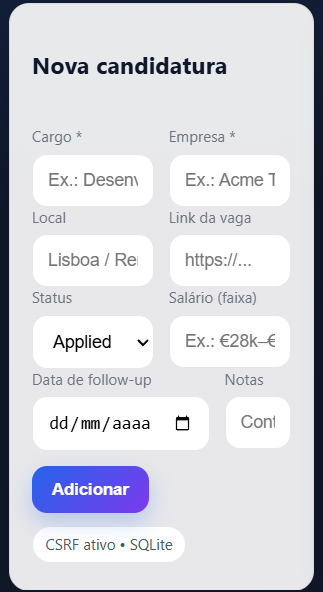
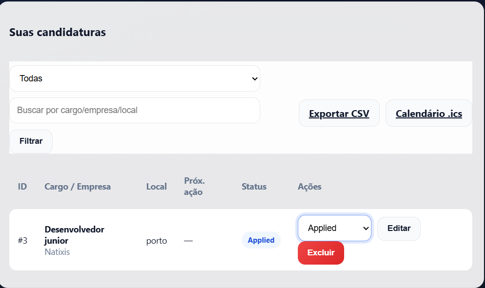

# JobTrackr — rastreador de candidaturas (PHP + SQLite)

**JobTrackr** é um app leve (single-file) para organizar candidaturas de emprego: registe *cargo*, *empresa*, *status* (Applied, Screening, Interviewing, Offer, Rejected), *follow-up* com data, *notas* e exporte tudo em **CSV** ou **.ics** para o seu calendário.

> UI moderna (glass, gradientes), responsiva e com animações suaves.  
> Perfeito para uso pessoal e como **case técnico** no portefólio.

---

##  Funcionalidades

-  **CRUD completo** de candidaturas  
- **Filtros + busca** por cargo, empresa e local  
- **Badges de status** com cores (Applied/Screening/Interviewing/Offer/Rejected)  
- **Follow-up** por data e **exportação .ics** (Google Calendar/Outlook)  
- **Exportação CSV** para Excel/Sheets  
- **CSRF** ativo em todos os POSTs  
- **SQLite via PDO** (cria a base automaticamente)  
- **Código single-file** fácil de ler e levar para entrevistas

---

## Screenshots / Demo

> Substitua as imagens abaixo por capturas do seu ambiente.

| Nova candidatura | Lista + filtros |
|---|---|
|  |  |

> **Dica**: grave um GIF curto (adicionar > filtrar > exportar .ics) e salve como `docs/demo.gif`.  
> Depois, inclua aqui:
>
> ``

---

## Como executar

### Opção A) XAMPP (Windows)
1. Crie a pasta: `C:\xampp\htdocs\jobtrackr\`
2. Salve o arquivo **index.php** dentro dessa pasta.
3. Abra `C:\xampp\php\php.ini` e **habilite**:
